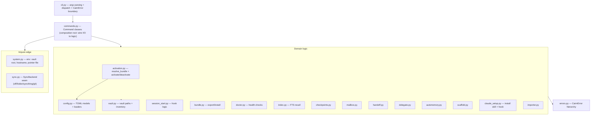

# Cairn — Architecture

For contributors. This maps what every module does, how they connect, and the invariants that keep
Cairn safe to run against a real machine. Per-symbol detail lives in the docstrings; this is the map.

## Layers

Cairn is a thin, layered CLI. Data flows top-to-bottom; the bottom layers are pure and don't import
the top.

## Modules

| Module | Responsibility | Key symbols |
|---|---|---|
| `cli.py` | Parse argv, dispatch to the selected `Command`, translate `CairnError`→ exit 1. The `Command` protocol + injectable registry live here. | `Command`, `build_parser`, `main` |
| `commands.py` | **Composition root.** One class per subcommand; `run()` locates the vault, loads config, calls the logic layer, prints. Dependencies (`vault_root`, `cwd`, `now`, and per-command `post`/`ping`/`cloner`) are injected with real defaults. | `*Command`, `all_commands` |
| `config.py` | Load `cairn.toml`/`profiles.toml` into frozen dataclasses; validate; apply defaults. Read-only (no TOML writer dep). | `CairnConfig`, `Profile`, `load_cairn_config`, `load_profiles` |
| `errors.py` | Exception base the CLI boundary catches. | `CairnError`, `ConfigError` |
| `vault.py` | Resolve paths inside `~/.cairn` and list skills/memories (directory scan). Raises if a referenced skill/memory is missing. | `Vault` |
| `system.py` | The impure edge for the environment: vault-root resolution (env → pointer file → default), hostname, pointer writes. | `default_vault_root`, `default_machine_name`, `set_vault_location` |
| `activation.py` | **The crux.** Pure `resolve_bundle` (merge profiles, expand `extends`, dedupe) + `activate`/`deactivate` (manifest-tracked symlinks, model backup/merge/restore, `.mcp.json` merge). | `resolve_bundle`, `activate`, `deactivate`, `Bundle` |
| `sync.py` | The `SyncBackend` seam + backends. `folder`/`syncthing` are no-ops (external tool syncs); `git` shells out via an injected runner; all best-effort. | `SyncBackend`, `OffSync`, `FolderSync`, `GitSync`, `make_sync_backend` |
| `delegate.py` | Local-model delegation with an injectable HTTP POST; fail-loud on unreachable. | `Delegator`, `DelegateUnreachable` |
| `checkpoints.py` | Warm-start notes: newest-first, machine-stamped, per project. | `write_checkpoint`, `latest_brief` |
| `automemory.py` | Redirect `autoMemoryDirectory` into the synced vault. | `enable`, `disable` |
| `mailbox.py` | Tier-0 cross-machine messages as files in the synced vault. | `send`, `inbox`, `mark_read` |
| `handoff.py` | Compose/parse handoff payloads (marker + project + profiles + brief). | `build_handoff_payload`, `latest_handoff` |
| `index.py` | `recall` — in-memory SQLite FTS5 over memories + notes, substring fallback. | `search` |
| `doctor.py` | Health checks returning typed `Check`s; injectable `ping`. | `run_checks`, `Check` |
| `session_start.py` | Hook logic: auto-activate the default profile + inject the latest brief; returns the JSON payload. | `build_session_start_output` |
| `claude_setup.py` | Install the bundled skill + merge the `SessionStart` hook into `~/.claude` (idempotent). | `install_skill`, `install_session_start_hook` |
| `scaffold.py` | Write starter `cairn.toml`/`profiles.toml` (non-destructive). | `write_starter_config` |
| `importer.py` | Seed the vault from an existing `~/.claude`. | `import_into_vault` |
| `bundle.py` | Shareable bundles: export (flatten + copy assets + JSON manifest) / install (copy + append profiles via a tiny TOML emitter). | `export_bundle`, `install_bundle` |
| `data/skill/SKILL.md` | The bundled Cairn skill that teaches Claude the commands. | — |

## Two key flows

**`cairn use <profile>` (activation):**
`UseCommand.run` → `load_profiles` → `resolve_bundle` (expand `extends`, merge, dedupe; raises on
unknown/cycle) → `activate`: validate every skill/memory exists (raises *before* any write) →
snapshot `settings.local.json` → symlink skills into `.claude/skills/` and memories into
`.claude/rules/` → merge `model` → merge MCP servers into `.mcp.json` → write
`<project>/.cairn/manifest.json` (the reversal record) + `state.json` → gitignore `.cairn/`.
`cairn clear` replays the manifest in reverse.

**Session start (auto):** Claude runs `cairn session-start` → `build_session_start_output`: if nothing
is active and a default profile is set, `activate` it; collect the latest brief → return
`{additionalContext, reloadSkills}` JSON. The command swallows *all* exceptions and emits `{}` so a
broken hook can never break a Claude session.

## Design invariants

- **All-or-nothing.** Activation validates everything before touching disk — a bad bundle changes nothing.
- **Cairn only removes what it created.** The manifest records every symlink + the prior model; nothing
  else is ever deleted or clobbered (hand-placed files/servers are left alone).
- **Files are the source of truth.** The vault is plain markdown/dirs; indexes (SQLite) are throwaway
  caches rebuilt from files. No opaque database.
- **Best-effort, non-blocking sync.** Network/sync failures warn and continue; they never hang or corrupt.
- **The hook never breaks a session.** `session-start` is exception-swallowing by contract.
- **Impure at the edges.** `system.py` and the injected `post`/`ping`/`cloner`/`runner`/clock are the
  only non-deterministic pieces; the logic layer is pure and unit-tested without a network or real env.

## Testing

Every module has `tests/test_<module>.py`. Tests follow the [develop standard](../CLAUDE.md): real temp
vaults/projects (no filesystem mocks), assert **exact data** in/out **and** the interactions (call
count + payload) for every external call, and cover failure/edge branches. Run `pytest` + `ruff check .`.
